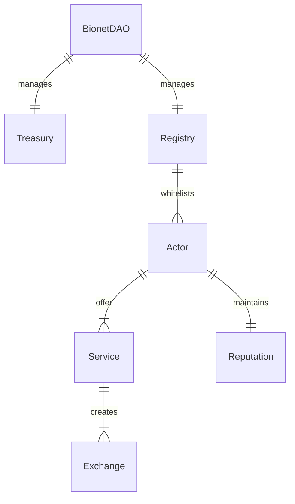

# Smart Contract Protocol

The protocol is designed to enable the exchange of goods and services on the Bionet. In general, you can think of it as an escrow service, or trusted "middle-man", that ensures fees and assets are distributed as expected to the parties involved in an exchange. It uses incentives to encourage participants to follow the rules of the system to enforce atomic exchanges where either both parties get what they expect, or none do.

Our current effort is focused on a minimal viable product (MVP). We're intentionally keeping the core logic as simple as possible as we work through the needs of the Synthetic Biology (SynBio) community.

## Design

## Description
**BionetDAO:**  Governing entity for the ecosystem. Responsible for:
- Vetting bionet participants (actors)
- Maintaining a registry of vetted actors
- Curating proposals (protocol, etc...)
- Managing the use of protocol fees

**Treasury:** Collects and stores protocol fees. Will require mult-signature approval for moving funds

**Registry:** Maintains a list of vetted actors (by wallet address).  Think of this as KYB (know your biologist)

**Actor:** A user in the system. An actor may be a buyer or seller of services (individual or organization), or a moderator used to resolve exchange disputes.  An actor will be represented by an NFT (erc721 or erc1155).

**Reputation:** An actor will accumulate a reputation over time. Reputation will start with the BionetDAO vetting process.

**Service:** Represents an offering on the Bionet. A service should be fine-grained and contain information about the terms and conditions, any associated intellectual property.

**Exchange:** The core logic for managing the exchange of a service.  An exchange is based on terms and conditions and price (which may include free stuff). [Read more](exchange.md) 

