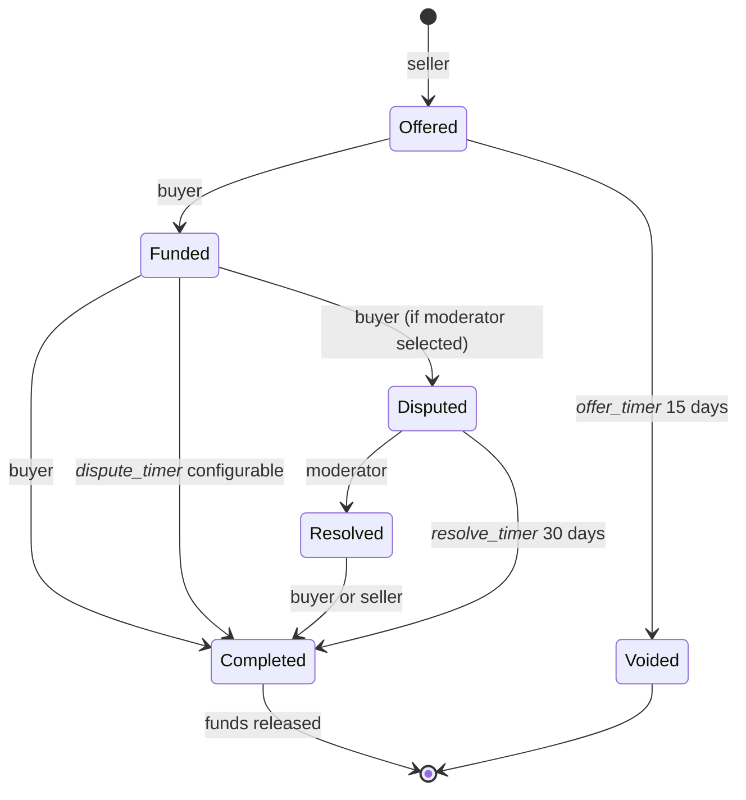

# Exchange Contract
The core logic for the exchange of services.

# Overview
Each service may have many exchanges. An exchange serves as an escrow service and manages the release of funds based on the state machine below.

The are 3 primary actors in an exchange:
- Buyer
- Seller
- Moderator (optional)

# State Machine


## Buyer looking for a service 
1. Buyer searches the bionet for a specific need, e.g. *create a protein*.
2. When the buyer finds a service they're interested in, they may contact the service provider off-chain to negotiate work, terms, etc.... The complexity and current state of synthetic biology often requires *talking to someone* (off-chain) in the initial phases of the engagement. 

## Seller creates an offer (Offered)
1. Once an agreement is reached between the parties, the seller creates an `offer`.  This is a form of contract (estimate) unique to the buyer/seller, terms of service, price, etc....
2. Creating an Offer, starts a timer. The buyer must commit to the offer within the timer (default 15 days) or the offer is voided.

## Buyer commits by funding the offer (Funded)
1. If the offer hasn't expired, the buyer can commit to it by sending a signed transaction that includes the funds equal to the agreed upon price of the service.
2. The funds are escrowed by the Exchange. Ensuring the seller will get paid if everything goes as expected.
3. A configurable timer is started to to track progress of the exchange.  During this time the seller may performing the service, shipping, etc...  Once the buyer receives the product, they have 3 options:
   1. Sign off of the exchange. Moving to the *complete* state.
   2. Do nothing. Let the timer expire which will a automatically move to the *completed* state. Or...
   3. Dispute the exchange

## Buyer completes the exchange (Completed)
Once the exchange reaches the *completed* state, the escrowed funds are transfered to the seller, and a protocol fee is paid to the bionet (unless there is a dispute). The seller is responsible for protocol fees:
```text
DueProtocol = price * protocol fee
DueSeller = service price - DueProtocol
```

An exchange is officially locked and closed once it transistions to the *completed* state

## Or... buyer disputes the exchange (Disputed)
Dealing with disputes between buyer and seller can be difficult. Based on ideas from [OpenBazaar](https://en.wikipedia.org/wiki/OpenBazaar) the Bionet uses the concept of a *moderator* to help resolve disputes.

**What is a moderator?**
A moderator is a vetted member of the Bionet that can serve as an intermediary in the event of a dispute in an exchange.  During the creation of an Offer, the buyer and seller can optionally decide on a moderator to resolve any potential issues with the exchange of the service. Resolution of a dispute by a moderator will result in a refund. There are 3 types of possible refunds:
- **Full:** Buyer will receive a full refund 
- **Partial:** Buyer will receive a 50% of the service price
- **None:** No refund given. The original terms of the exchange apply 

**Rules on the use of moderator**
- An exchange may or may not have a moderator
- If the buyer and seller trust each other in the exchange, they can elect not to have a moderator. This is referred to as a **direct** exchange.  A direct exchange has no *dispute* phase in the protocol.  
- A service offered for free does not have a moderator and dispute phase.
- A moderator receives a fee for their service paid by the buyer. Unless the dispute is ruled "no refund" in which case, the seller pays the moderator fee.
- A moderator is also a service on the bionet. The moderator will advertise their fee and rules on how they handle a dispute.
- If a dispute is filed by a buyer, the moderator receives their fee regardless of the type of refund.
- A bionet protocol fee is NOT collected in the event of a dispute.
- Resolving a dispute requires a threshold of 2-of-3 signatures from the parties to the exchange (moderator, buyer, seller).

Calculating final balances:

**Full Refund**
```
DueModerator = price * fee
DueBuyer =  price - DueModerator
```
**Partial Refund**
```
half = price / 2
DueModerator = price * fee
DueBuyer = half - DueModerator
DueSeller = half
```
**No refund**
```
DueBuyer = 0
DueModerator = price * fee
DueSeller = price - DueModerator
```
An invariant of the exchange: Escrowed funds should always equal the sum of all payouts.
```
Escrowed Funds == dueSeller + dueBuyer + dueProtocol + dueModerator
```

## Buyer makes a dispute
1. If the `funded` phase timer has not expired, the buyer can activate a dispute.
2. A dispute timer is started and is active for 30 days.
3. If the dispute is not resolved within 30 days, the exchange completes as normal and the moderator does not receive their fee.

During the dispute phase, the moderator collects the needed information from both the buyer and seller to make a decision on the appropriate refund (if any).  Once the moderator makes a decision on the type of refund ( completing 1-of-3 required signatures), It's up to either the buyer or seller to sign off on the agreement to fulfill the 2-of-3 signature requirement.  Signatures are accomplished by the party sending a signed transaction the contracte *resolve* function.

Once the dispute is resolved and signed off on, the funds are released to their respective parties and the exchange moves to the *complete* state.

## Events
During the flow of an exchange, several different events are emitted from the contract that describe the current state of the exchange.  Those events are collected by the *dApp Indexer* and made available to the *dApp UI*.


