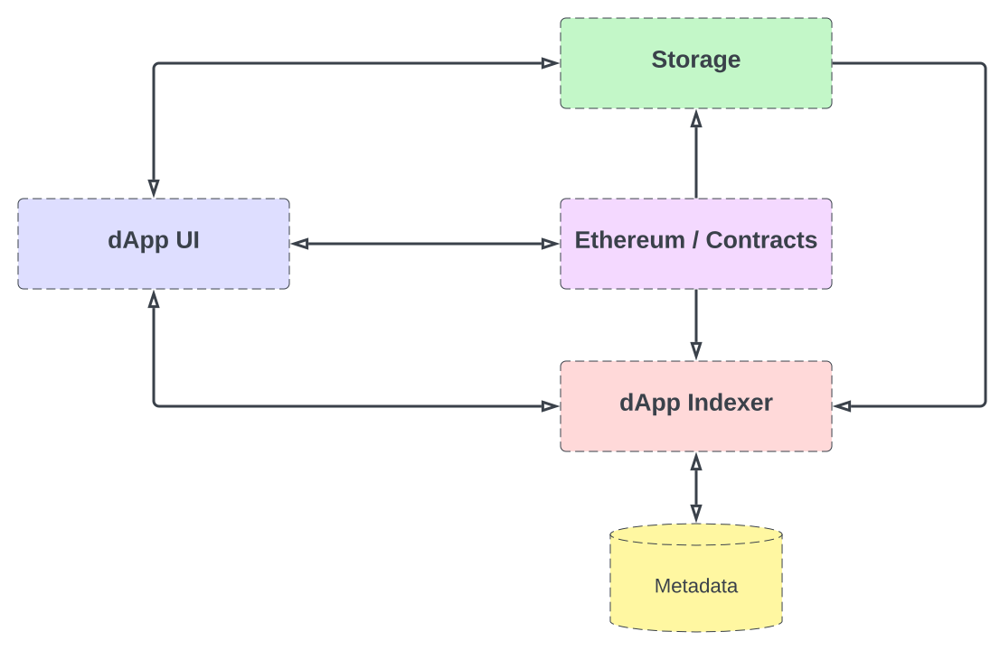

# High Level Design

Bionet consists of several architecture components:

## dApp UI
A React SPA user-interface to the Bionet.

## dApp Indexer
Webserver with an API used by the UI to provide information to the user. This includes a process that listens for specific Ethereum events to store in 'metadata'.   Future version will most likely use 'the graph' protocol and node.

## Metadata
The simplest possible database needed to store information for the dApp UI/Indexer. In a perfect dApp you wouldn't want a centralized DB. 

## Storage
Decentralized storage used to store information related to services: *terms and conditions, description, licensing*, etc... This may be IPFS or Arweave.

## Ethereum/Contracts
A set of smart contracts on Ethereum that define the core protocol.  [Read more](contracts.md)

## Sign in with Ethereum (SIWE)
Users will use their Ethereum wallet to authenticate to the system. Only vetted Bionet users can access the initial Bionet. SIWE requires digital signatures from the user's wallet.  The signature proves ownership of the wallet and associated address. The address is compared against vetted (authorized) user addresses.

