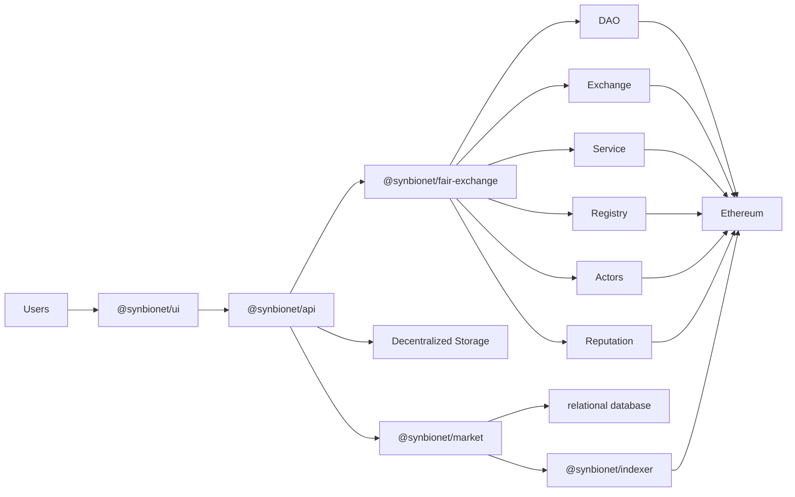
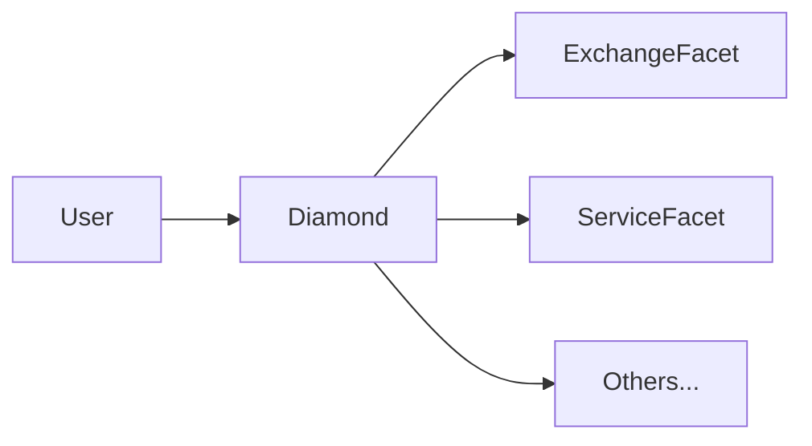

# Bionet

**Key Components:**

## @synbionet/ui
A React SPA user-interface to the Bionet.

## @synbionet/api
A typescript API used to simplify interacting with key components.

## @synbionet/fair-exchange
Core smart contract protocol

## @synbionet/market
Bionet operated web application to collect data and provide information to the UI

## @synbionet/indexer
Monitors Ethereum for bionet related events and stores in `@synbionet/market` database.
Future versions will likely use 'the graph' protocol.

## Contract Architecture
The smart contracts of the system are architected with a [Diamond Pattern](https://eips.ethereum.org/EIPS/eip-2535). This pattern is used to allow upgrades, improve storage, and make it easier to track events emitted by the system.  While several contracts (or facets) are deployed, they're all accessed through the single address of the core `diamond` contract. 

